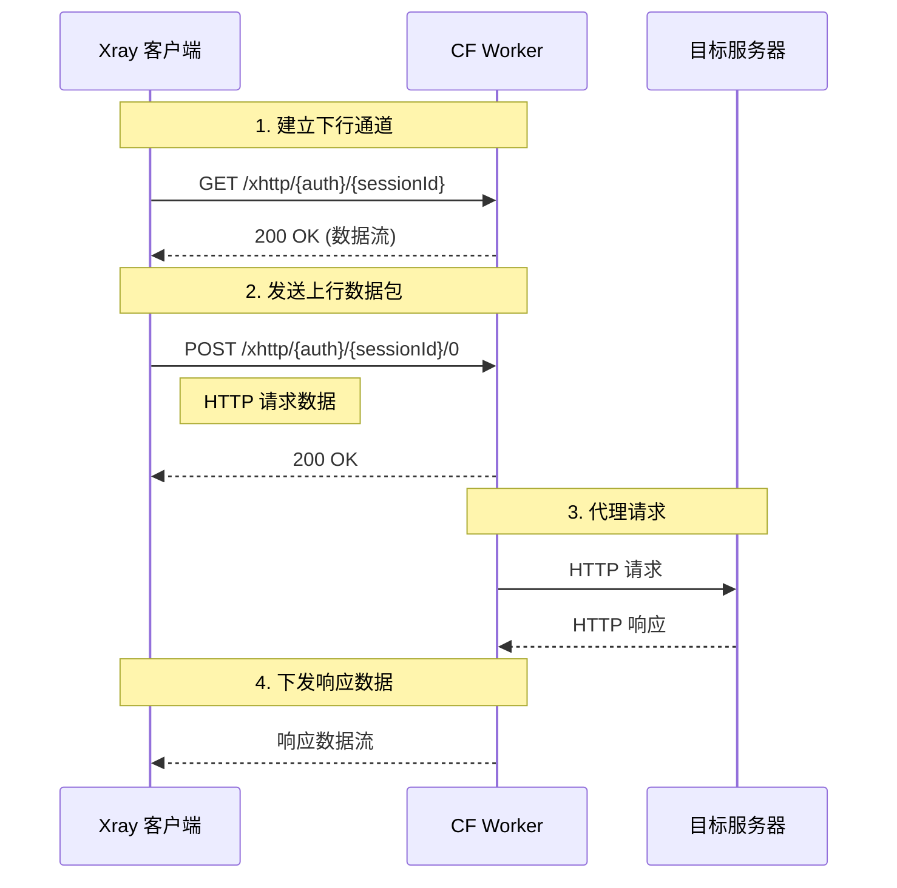

# XHTTP HTTP 代理服务器 - 部署指南

## 项目简介

基于 [Xray-core XHTTP](https://github.com/XTLS/Xray-core/tree/main/transport/internet/splithttp) 协议的 HTTP 代理服务器，运行在 Cloudflare Workers 上。使用 XHTTP packet-up 模式作为传输层，通过 Path 鉴权替代 VLESS UUID 验证。

> [!IMPORTANT]
> ⚠️ Disclaimer
>
>免责声明：
>此处只探讨协议组合的可能性，仅供教育、科学研究及个人安全测试之目的，代码均由ai生成，稳定性就是一坨💩。
>
>XHTTP协议本身比较慢，同条件下请求数大于ws、grpc，不要用作主力协议，为了安全起见，绑定自定义域名后限制asn/ip访问。
>
>建议在测试完成后 一坤 时（2.5小时）内删除本项目相关部署。
>
>只支持xray-core，v2rayN(G)、exclave可以使用
>
>特殊提醒：由于cloudflare Durable Objects免费版本限制，部署后一开始大概率能用，用一段时间后就连接不上了，
>
>此时如果你打开了Workers Observability，你应该会看到这个`Exceeded allowed duration in Durable Objects free tier.`
> 
>看到这个不用怀疑，这个节点用不了了，等到下一个 UTC 0:00 重置Durable Objects.
> 
>[相关文档](https://developers.cloudflare.com/durable-objects/platform/pricing/#compute-billing)
>
>[http xhttp(stream-one版本)](https://raw.githubusercontent.com/Fido6/tool-and-other-backup/refs/heads/main/worker%E8%84%9A%E6%9C%AC/cf_http_xhttp.js) 不依赖Durable Objects，⚠️需要自定义域名+开启grpc，稳定性更是一坨臭狗屎

客户端推荐设置 XHTTP EXTRA: `{"xmux":{"maxConcurrency":1}}`

没有订阅链接，建议把网页给的配置按需填写到v2rayN里面，单独导出完整配置，（手机端可以直接用exclave输入配置）


## 功能特性

- ✅ XHTTP packet-up 模式传输
- ✅ 标准 HTTP 代理协议
- ✅ Path 鉴权（auth_token）
- ✅ 会话管理与自动清理
- ✅ 配置生成
- ✅ CORS 支持

需求： 一个正常的cloudflare账号（可以正常部署worker的账号），
      一个域名（按需）

## 快速开始

### 1. 安装依赖

克隆到本地，这里不教，

```bash
cd cf-worker
npm install
```

### 2. 配置环境变量

编辑 [`wrangler.toml`](wrangler.toml)：

```toml
[vars]
# 必填：鉴权令牌（建议使用强随机字符串，尽量不要使用特殊字符）
AUTH_TOKEN = "your-strong-secret-token"

# XHTTP 路径前缀
XPATH = "xhttp"

# 订阅路径
SUB_PATH = "sub"

# 节点名称
NAME = "CF-Worker-Proxy"

# FAKE_WEB（反代其他网页，留空则不启用，例如：https://www.example.com）
FAKE_WEB = "https://www.example.com"
```

### 3. 本地开发

```bash
npm run dev
```

访问 http://localhost:8787/ 验证服务运行。

### 4. 部署到 Cloudflare

```bash
npm run deploy
```

## 使用方法

### 获取订阅链接

访问 `https://your-worker.your-domain.com/${SUB_PATH}`
强烈推荐使用自定义域名，返回配置内容。

### XHTTP 路径格式

```
/{xpath}/{auth_token}/{session_id}/{seq}
```

- `xpath`: XHTTP 路径前缀（默认 `xhttp`）
- `auth_token`: 鉴权令牌
- `session_id`: 客户端生成的随机会话 ID
- `seq`: 数据包序列号（从 0 开始）

### HTTP 路由

| 路径 | 方法 | 功能 |
|------|------|------|
| `/` | GET | 健康检查 |
| `/{SUB_PATH}` | GET | 获取订阅链接 |
| `/{XPATH}/{auth}/{sessionId}` | GET | 建立下行数据流 |
| `/{XPATH}/{auth}/{sessionId}/{seq}` | POST | 上传数据包 |
| `/{XPATH}/{auth}/{sessionId}/{seq}` | OPTIONS | CORS 预检 |

## Xray 客户端配置示例

```json
{
  "inbounds": [
    {
      "port": 1080,
      "protocol": "socks",
      "settings": {
        "udp": true
      }
    }
  ],
  "outbounds": [
    {
      "protocol": "freedom",
      "streamSettings": {
        "network": "xhttp",
        "xhttpSettings": {
          "path": "/{XPATH}/{auth_token}",
          "host": "your-worker.your-domain.com",
          "mode": "packet-up"
        },
        "security": "tls",
        "tlsSettings": {
          "serverName": "your-worker.your-domain.com",
          "fingerprint": "chrome"
        }
      }
    }
  ]
}
```

## 协议流程



## 技术细节

### 数据包重组

- 使用优先队列（最小堆）按序列号重组数据包
- 缓冲区大小限制：30 个数据包
- 超时自动清理：30 秒

### 会话管理

- 会话存储在内存中（Map 结构）
- 支持最大并发会话数受内存限制
- 空闲 30 秒后自动清理

### 响应头，此处修改Content-Type可以伪装成其他类型流量

```http
X-Accel-Buffering: no
Cache-Control: no-store
Content-Type: application/octet-stream
Transfer-Encoding: chunked
```

## 注意事项

1. **鉴权安全**：请使用强随机字符串作为 AUTH_TOKEN（建议 32+ 字符）
2. **内存限制**：CF Worker 内存限制 128MB（付费计划）
3. **冷启动**：冷启动时会话会丢失，需要客户端重新建立连接
4. **CPU 时间**：单次请求处理时间限制 30 秒（付费计划）

## 调试

### 查看日志

```bash
npm run tail
```

### 常见问题

1. **401 Unauthorized**：检查 AUTH_TOKEN 是否匹配
2. **404 Not Found**：检查路径格式是否正确
3. **502 Bad Gateway**：目标服务器不可达
4. **连接超时**：检查会话是否建立成功
5. 由于bug的存在，目前暂时不支持 http basic认证

## 更新日志

### v1.0.0 (2026-06-06)
- 初始版本
- 实现 XHTTP packet-up 模式
- 实现 Path 鉴权
